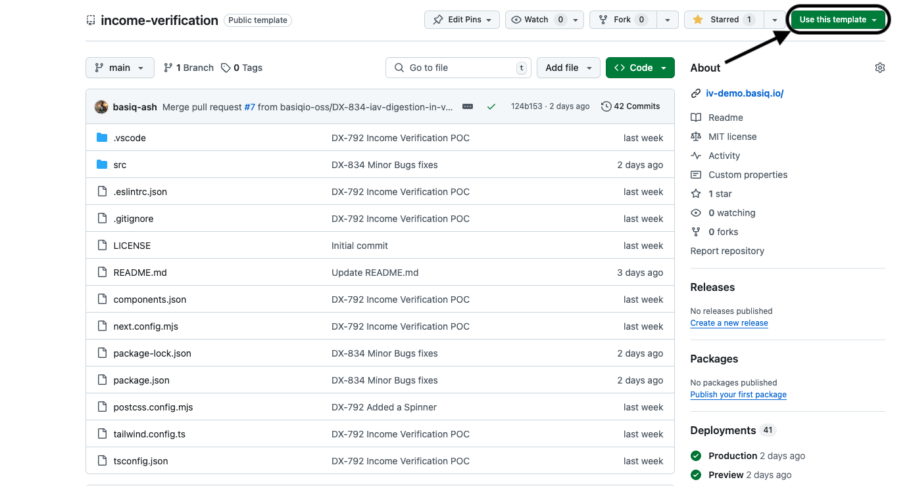

# Income Verification App

The Income Verification Starter Kit is a comprehensive solution for automating the process of verifying user income through secure bank account connections. Utilising the Basiq Reports API, this kit generates detailed income verification reports that include both user-level and group-level analysis. It enables developers to seamlessly integrate income verification into their applications, providing a thorough understanding of users' financial situations.

## Features

- **User Authentication**: Simple login page to generate an authentication token.
- **Report Generation**: Generate income verification reports via the Basiq API.
- **Dashboard**: View and manage generated reports (accessible after login).

## Technologies

- **Next.js**: React framework for server-side rendering and static site generation.
- **shadcn/ui**: A modern UI library for React.
- **Axios**: Promise-based HTTP client for making API requests.

## Getting Started

### 1. Use the template to create your own repository

    To get started, you will need click the "Use this template" button on the main page of the repo - this will generate a new repository.

    

    Then you will need to clone the repository you have just generated. 

### Prerequisites

- Node.js (>=14.x)
- npm or yarn

### Installation

1. **Clone the repository:**

    ```bash
    git clone https://github.com/your-repo/income-verification.git
    cd income-verification
    ```

2. **Install dependencies:**

    ```bash
    npm install
    # or
    yarn install
    ```

3. **Set up environment variables:**

    If you haven't already, [Sign-up](https://dashboard.basiq.io/login) to the Basiq API service and grab your API key for your application (via the [Developer Dashboard](https://dashboard.basiq.io/)).

    Once you have a Basiq API key, move the sample `.env.sample` file to `.env.local` and paste in your Basiq API key next to `BASIQ_API_KEY=`

    ```sh
    mv .env.sample .env.local
    ```

    ```diff
    - NEXT_PUBLIC_BASI_Q_API_KEY=
    + NEXT_PUBLIC_BASI_Q_API_KEY=abc123
    ```


4. **Run the development server:**

    ```bash
    npm run dev
    # or
    yarn dev
    ```

    Navigate to `http://localhost:3000` to see the application in action.

## API Integration

- **Token Generation**: The login process calls the Basiq API to generate a token. The API endpoint used is `https://au-api.basiq.io/token`.
